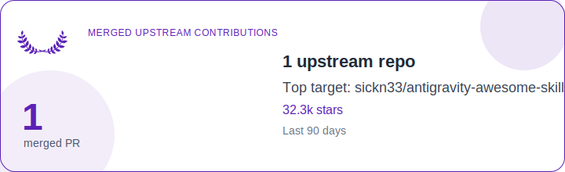
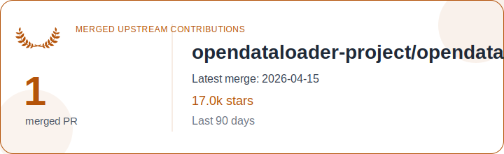

# README Updater

## Usage

Set environment variables:

```bash
export GITHUB_TOKEN=ghp_example
export GITHUB_USER=nguyenhuuloc
export README_PATH=README.md
export SVG_OUTPUT=assets/contributions.svg
export DEFAULT_DAYS=30
```

Run the updater:

```bash
python -m readme_updater.cli update --days 30
```

Dry-run the generated README block:

```bash
python -m readme_updater.cli update --days 3 --dry-run
```

<!-- contributions:start -->
## Recent Open Source Contributions

### SVG Cards By Repository

<table>
  <tr>
    <th>Repository</th>
    <th>Latest Merge</th>
    <th>Contribution Card</th>
  </tr>
  <tr>
    <td><a href="https://github.com/sickn33/antigravity-awesome-skills">sickn33/antigravity-awesome-skills</a></td>
    <td>2026-01-19</td>
    <td align="center">
      
    </td>
  </tr>
  <tr>
    <td><a href="https://github.com/HKUDS/DeepTutor">HKUDS/DeepTutor</a></td>
    <td>2026-04-08</td>
    <td align="center">
      
    </td>
  </tr>
  <tr>
    <td><a href="https://github.com/opendataloader-project/opendataloader-pdf">opendataloader-project/opendataloader-pdf</a></td>
    <td>2026-04-15</td>
    <td align="center">
      
    </td>
  </tr>
  <tr>
    <td><a href="https://github.com/chatgptprojects/clear-code">chatgptprojects/clear-code</a></td>
    <td>2026-04-02</td>
    <td align="center">
      
    </td>
  </tr>
</table>
<!-- contributions:end -->
