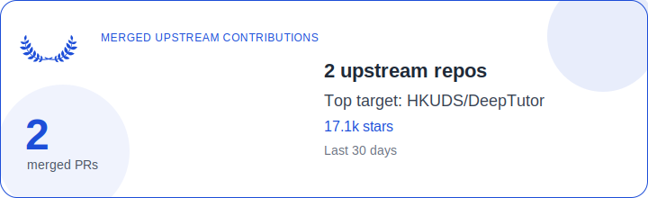

# README Updater

## Usage

Set environment variables:

```bash
export GITHUB_TOKEN=ghp_example
export GITHUB_USER=nguyenhuuloc
export README_PATH=README.md
export SVG_OUTPUT=assets/contributions.svg
export DEFAULT_DAYS=30
```

Run the updater:

```bash
python -m readme_updater.cli update --days 30
```

Dry-run the generated README block:

```bash
python -m readme_updater.cli update --days 3 --dry-run
```

<!-- contributions:start -->
## Recent Open Source Contributions

_Merged in the last 30 days_

### Contribution Snapshot

<p align="center">
  
</p>

| Metric | Value |
|---|---|
| Total merged PRs | 2 |
| Repositories | 2 |
| Top repository | [HKUDS/DeepTutor](https://github.com/HKUDS/DeepTutor) (17.1k stars) |

### Contribution Table

| Repository | Stars | PR | Merged |
|---|---:|---|---|
| [HKUDS/DeepTutor](https://github.com/HKUDS/DeepTutor) | 17.1k | [docs: clarify github copilot provider login semantics](https://github.com/HKUDS/DeepTutor/pull/262) | 2026-04-08 |
| [chatgptprojects/clear-code](https://github.com/chatgptprojects/clear-code) | 2.0k | [fix: correct README repository metrics links](https://github.com/chatgptprojects/clear-code/pull/13) | 2026-04-02 |

### SVG Cards By Repository

<p align="center">
  
  <br/>
  
  <br/>
</p>
<!-- contributions:end -->
